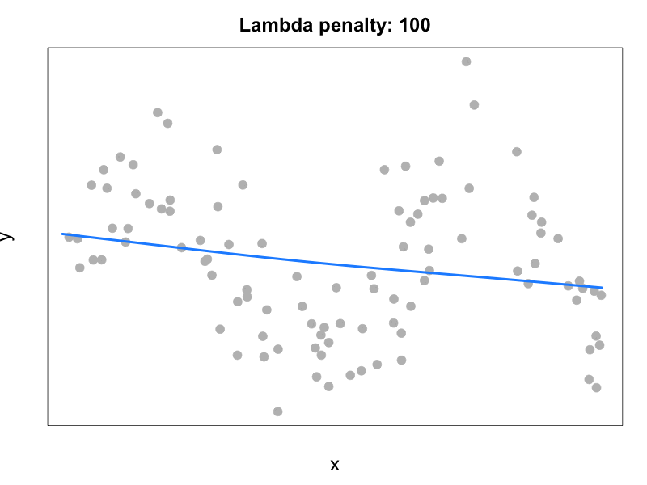

```{r setup, include=FALSE}
knitr::opts_chunk$set(echo = FALSE, message = FALSE, warning = FALSE)

library(mgcv)
```


## Acknowledgements 

Gavin Simpson and colleagues have produced a lot of useful teaching material on GAMs that I've made use of here. For example: 

[Gavin's blog](https://fromthebottomoftheheap.net)

[Webinar 1](https://www.youtube.com/live/sgw4cu8hrZM?si=pDEYp2OdKB7guJ8T&t=285)

[Webinar 2](https://youtu.be/Ukfvd8akfco?si=g17GQv2ExA1KA0oO&t=8)


## Goals for today

* Understand what a smoother is and understand the motivation for using a smoother in a model 

* Learn how to fit some basic GAMs with splines  


## Assumptions of linear models 

* Linear relationship between predictor and response 

> * Observations are a random sample from the population    

> * The predictor(s) are known without measurement error  

> * If 2+ predictors, they are independent of each other

> * Errors are IID: $\epsilon_i \sim \text{N} (0, \sigma); ~ \text{Cov}(\epsilon_i, \epsilon_{j \neq i}) = 0$


## Non-linear relationships?

* For Gaussian LMs we assume a linear relationship between predictor and response

> * For non-Gaussian GLMs, we assume a linear relationship between link(predictor) and response

<br> 

> * What if we think the relationship is _non-linear_? 


## Non-linear data | Sea surface temperature anomalies from Hadley Centre (UK Met Office)

```{r sst_data, fig.align = "center", fig.width = 8, fig.height = 4.5}

## global SST data
## https://crudata.uea.ac.uk/cru/data/temperature/HadSST4.2_gl.txt

sst <- read.csv("SST_anomolies.csv")

sst <- sst[seq(2, nrow(sst), 2), -ncol(sst)]

colnames(sst) <- c("year", month.abb)

anom <- apply(sst[,-1], 1, mean)

sst <- data.frame(year = sst$year, temp = anom)
  
## fit polynomial
model_poly <- lm(temp ~ poly(year, degree = 10), data = sst)

preds_poly <- predict(model_poly, se.fit=TRUE)

t_value <- qt(0.025, length(sst$year) - 8, lower.tail = FALSE)

## compute CI's
up_95 <- preds_poly$fit + t_value * preds_poly$se.fit
lo_95 <- preds_poly$fit - t_value * preds_poly$se.fit

## plot the data
par(mai = c(0.9, 0.9, 0.1, 0.1),
    omi = c(0, 0, 0, 0),
    cex.lab = 1.4, cex.axis = 1.2)
plot(sst$year, sst$temp,
     ylim = range(up_95, sst$temp, lo_95),
     type = "l", lwd = 3, col = "dodgerblue",
     ylab = "Temperature anomaly", xlab = "Year")
abline(h=0, lty = "dashed")
```


## Non-linear relationships | A degree-10 (decic) polynomial fit to the data

```{r plot_poly, fig.align = "center", fig.width = 8, fig.height = 4.5}
par(mai = c(0.9, 0.9, 0.1, 0.1),
    omi = c(0, 0, 0, 0),
    cex.lab = 1.4, cex.axis = 1.2)

plot(sst$year, sst$temp,
     ylim = range(up_95, sst$temp, lo_95),
     type = "l", lwd = 3, col = "dodgerblue",
     ylab = "Temperature anomaly", xlab = "Year")
abline(h=0, lty = "dashed")
lines(sst$year, preds_poly$fit, lwd = 2)
lines(sst$year, up_95, lty = "dashed", lwd = 2)
lines(sst$year, lo_95, lty = "dashed", lwd = 2)
```


## Generalized additive models 

We seek a model that allows for some smooth **and** non-linear relationship between year and temperature 


## Generalized additive models 

We seek a model that allows for some smooth **and** non-linear relationship between year and temperature 

<br>

A generalized additive model is an extension of the GLM with a predictor that is a sum of smoothed (and possibly unsmoothed) terms: 

$$
y_i = \beta_0 + \sum_j s_j(x_{j,i}) + \sum_k \beta_k x_{k,i} + \epsilon_i
$$


## Type of GAMs | LOESS (<u>LO</u>cally <u>E</u>stimated <u>S</u>catterplot <u>S</u>moothers) 

Fit many local (weighted) regressions within a sliding window 
  
LOESS fitting is available in the `mgsv::gam()` function


## Type of GAMs | LOESS (LOcally Estimated Scatterplot Smoothers) 

<u>Pros</u> 
 
* Pretty simple and easy to understand 
  

## Type of GAMs | LOESS (LOcally Estimated Scatterplot Smoothers) 

<u>Pros</u> 
 
* Pretty simple and easy to understand 
  
<u>Cons</u> 

* Size of the window (and hence the degree of smoothness) matters, but there isn't much theory to help you choose
  
> * If we make the window big, we'll essentially get a linear regression, if we make it small, we will overfit (or "under-smooth")  
  
> * LOESS isn't very reliable near the ends of the data  


## Type of GAMs | Splines

* Much more flexible and adaptable than LOESS smoothing

> * Can be applied to lots of non-Gaussian error distributions & with random effects 

> * The degree of smoothness can be estimated as part of model fitting via restricted maximum likelihood or generalized cross validation


## What are splines? 

Splines are _basis expansions_

For example, a polynomial is one type of basis expansion: 

$$ 
\begin{aligned}
x^0 &= 1\\
x^1 &= x\\
x^2 &= x^2\\
x^3 &= x^3\\
&~~\vdots
\end{aligned}
$$


## What are splines? 

In a basis expansion

* We call each of the simpler functions a _basis function_

* The set of simpler functions, $b_k$, is called a _basis_


## What are splines?

When we model using splines, each of the $b_k$ has a coefficient $\beta_k$

<br>

The spline is the sum of these functions (weighted by $\beta_k$ and evaluated at $x$): 

$$
s(x)=\sum_k \beta_k b_k(x)
$$


## Types of splines

One of the easiest to think about is a cubic regression spline

* $X$ is divided into intervals (defined by the number of "knots")


## Types of splines

One of the easiest to think about is a cubic regression spline

* $X$ is divided into intervals (defined by the number of "knots")

* In each interval, we fit a cubic polynomial

$$
y_i = \beta_0 + \beta_1 x_i + \beta_2 x_{i}^2 + \beta_3 x_{i}^3
$$ 

> * The fitted values per interval are stuck together to form the curve

> * The intervals connect at the knots

> * To obtain a smooth connection at the knots, certain conditions are imposed


## How do we go from a basis to a model fit?  

We want to allow for a function that is "wiggly", but not too wiggly

* A function that is too wiggly would indicate that we are overfitting (or undersmoothing)

* Once again, we are looking for a model that fits key processes generating the data while not overfitting the nuances of an individual dataset  

<br> 

* We need just the right level of wiggliness, but how do we measure wiggliness? 


## Measuring wiggliness 

First, consider the squared second derivative:

$$
\int_{\mathbb{R}}[f'']^2dx
$$

This is the rate of change in the slope - more wiggliness will result in a higher rate of change in the slope 

<br> 

We estimate this with:  

$$
\int_{\mathbb{R}}[f'']^2dx=\beta^TS\beta
$$

where $S$ is a penalty matrix, derived from our weighted basis functions 


## Measuring wiggliness

We now use this to penalize our likelihood function  

$$
log(\mathcal{L_p{|\beta}})=log(\mathcal{L{|\beta}}) - \lambda\beta^TS\beta
$$

where $\lambda$ is a smoothness parameter, indicating how much we penalize wiggliness 

<br> 

We will maximize this penalized likelihood


## Penalty on lambda affects wiggliness 

```{r ex_spline, fig.align = "center", cache = TRUE}
library(animation)

## Generate sample data
set.seed(514)
x <- runif(100, 0, 10)
y <- sin(x) + rnorm(100, sd = 0.5)
dat <- data.frame(x, y)

library(animation)

invisible(capture.output({
  ani.options(ani.dev = "png", ani.width = 800, ani.height = 600)
  ## animate over different lambda's
  saveGIF({
    for (penalty_val in 10^seq(2, -5, -1)) {
      ## fit GAM with varying smoothing parameter
      b <- gam(y ~ s(x, sp = penalty_val))
      
      ## plot the fit
      plot(dat$x, dat$y, 
           main = paste("Lambda penalty:", round(penalty_val, 3)),
           yaxt = "n", xaxt = "n",
           ylab = "y", xlab = "x",
           cex.main = 2, cex.lab = 2, cex.axis = 1.8,
           pch = 19, col = "gray", cex = 2)
      
      ## predict and plot the spline curve
      x_grid <- seq(0, 10, length.out = 100)
      y_pred <- predict(b, newdata = data.frame(x = x_grid))
      lines(x_grid, y_pred, col = "dodgerblue", lwd = 4)
    }
  }, interval = 0.5, movie.name = "gam_spline_fit.gif")
}))
```

<p align="center">
  { width=70% }
</p>


## More on wiggliness 

We set $k$ as the maximum wiggliness (this determines the number of knots)

but what should we choose for the smoothness parameter $\lambda$?


## Choosing $\lambda$

* `method = "REML"` uses a relationship between random effects and smoothers -- we can think of $\lambda$ as a prior on the spline coefficients 

> * We can also use generalized cross-validation 

> * There is reason to think that "REML" works best ([Wood 2011](https://doi.org/10.1111/j.1467-9868.2010.00749.x)) 


## What kind of splines? 

**thin plate spline** `s(X, bs = 'tp')` [default in `mgcv::gam()`]

* one knot for every unique value of $x$


## What kind of splines? 

**thin plate spline** `s(X, bs = 'tp')` [default in `mgcv::gam()`]

* one knot for every unique value of $x$

**cubic regression spline** `s(X, bs = 'cr')`  

* widely used, especially useful for big datasets 


## What kind of splines? 

**thin plate spline** `s(X, bs = 'tp')` [default in `mgcv::gam()`]

* one knot for every unique value of $x$

**cubic regression spline** `s(X, bs = 'cr')`  

* widely used, especially useful for big datasets 

**cyclic spline** `s(X, bs = 'cc')`

* join the ends of the spline


## What kind of splines? 

**thin plate spline** `s(X, bs = 'tp')` [default in `mgcv::gam()`]

* one knot for every unique value of $x$

**cubic regression spline** `s(X, bs = 'cr')`  

* widely used, especially useful for big datasets 

**cyclic spline** `s(X, bs = 'cc')`

* join the ends of the spline

**splines on a sphere** `s(X, bs = 'sos')`

_many_ others in `mgcv::gam()` for special situations 


## Fitting a GAM  

Let's fit a GAM using splines to the global temperature data 

```{r ex_gam_fit, echo = TRUE, results = TRUE}
ex_gam_fit <- mgcv::gam(temp ~ s(year), data = sst, method = 'REML')
```


## Summary of GAM fit {.smaller}

```{r model_summary}
summary(ex_gam_fit)
```


## GAM fit to the data 

```{r plot_gam_fit, fig.align = "center", fig.width = 8, fig.height = 4.5}
## model fits
preds <- predict(ex_gam_fit, se.fit = TRUE)

## construct CI's
t_crit <- qt(0.025, length(sst$year) - (1 + summary(ex_gam_fit)$s.table[1]),
             lower.tail = FALSE)

## plot the data & model fit
par(mai = c(0.9, 0.9, 0.1, 0.1),
    omi = c(0, 0, 0, 0),
    cex.lab = 1.4, cex.axis = 1.2)

plot(sst$year, sst$temp,
     ylim = range(up_95, sst$temp, lo_95),
     type = "l", lwd = 3, col = "dodgerblue",
     ylab = "Temperature anomaly", xlab = "Year")

abline(h = 0, lty = "dashed")

lines(sst$year, preds$fit, lwd = 2)

lines(sst$year, preds$fit + preds$se.fit * t_crit,
      lty = "dashed", lwd = 2)
lines(sst$year, preds$fit - preds$se.fit * t_crit,
      lty = "dashed", lwd = 2)
``` 


## Another example | Chinook salmon survival from homework #4

```{r chinook_SAR, fig.align = "center", fig.width = 7, fig.height = 4.5}
## read data
chinook <- read.csv("srss_chin_sar.csv")
  
chinook <- chinook[order(chinook$temp),]

## calculate survival
chinook$sar <- chinook$adults / chinook$smolts * 100

## plot SAR vs day
par(mai = c(0.9, 0.9, 0.1, 0.1),
    omi = c(0, 0, 0, 0),
    cex.lab = 1.4, cex.axis = 1.2)
plot(chinook$temp, chinook$sar,
     ylim = c(1, 6),
     las = 1, pch = 16, col = "dodgerblue",
     ylab = "Smolt-to-adult survival (%)", xlab = "Temperature (C)")
```


## Fit a GAM

```{r fit_gam_sar, echo = TRUE}
## fit GAM with spline for temp
ex_gam_fit <- gam(sar ~ s(temp),  
              data = chinook, method = "REML")
```


## Model fit and data {.smaller} 

```{r gam_fit_summary}
## model summary
summary(ex_gam_fit)
```


## Model fit and data

```{r plot_sar_gam,  fig.align = "center", fig.width = 7, fig.height = 4.5}
## model fits
preds <- predict(ex_gam_fit, se.fit = TRUE)

## construct CI's
t_crit <- qt(0.025, length(chinook$sar) - (1 + summary(ex_gam_fit)$s.table[1]),
             lower.tail = FALSE)

## plot the data & model fit
par(mai = c(0.9, 0.9, 0.1, 0.1),
    omi = c(0, 0, 0, 0),
    cex.lab = 1.4, cex.axis = 1.2)

plot(chinook$temp, chinook$sar,
     ylim = c(1, 6),
     type = "p", pch = 16, las = 1, col = "dodgerblue",
     ylab = "Smolt-to-adult survival (%)", xlab = "Temperature (C)")
## model fit
lines(chinook$temp, preds$fit, lwd = 2)
## 95% CI's
lines(chinook$temp, preds$fit + preds$se.fit * t_crit,
      lty = "dashed", lwd = 2)
lines(chinook$temp, preds$fit - preds$se.fit * t_crit,
      lty = "dashed", lwd = 2)
```


## GLM with quadratic term

```{r sar_glm_fit, echo = TRUE}
ex_glm_fit <- glm(cbind(adults, smolts - adults) ~ temp + I(temp^2),
                  family = binomial(link = "logit"),
                  data = chinook)
```


## Quadratic model fit and data

```{r plot_sar_glm,  fig.align = "center", fig.width = 7, fig.height = 4.5}
## model fits
preds <- predict(ex_glm_fit, se.fit = TRUE, type = "response")

## construct CI's
t_crit <- qt(0.025, length(chinook$sar) - 3,
             lower.tail = FALSE)

## plot the data & model fit
par(mai = c(0.9, 0.9, 0.1, 0.1),
    omi = c(0, 0, 0, 0),
    cex.lab = 1.4, cex.axis = 1.2)

plot(chinook$temp, chinook$sar,
     ylim = c(1, 6),
     type = "p", pch = 16, las = 1, col = "dodgerblue",
     ylab = "Smolt-to-adult survival (%)", xlab = "Temperature (C)")
## model fit
lines(chinook$temp, 100 * preds$fit, lwd = 2)
## 95% CI's
lines(chinook$temp, 100 * (preds$fit + preds$se.fit * t_crit),
      lty = "dashed", lwd = 2)
lines(chinook$temp, 100 * (preds$fit - preds$se.fit * t_crit),
      lty = "dashed", lwd = 2)
```


## Next time 

* Model checking 

* More on model selection 

* The flexibility of GAMs   
